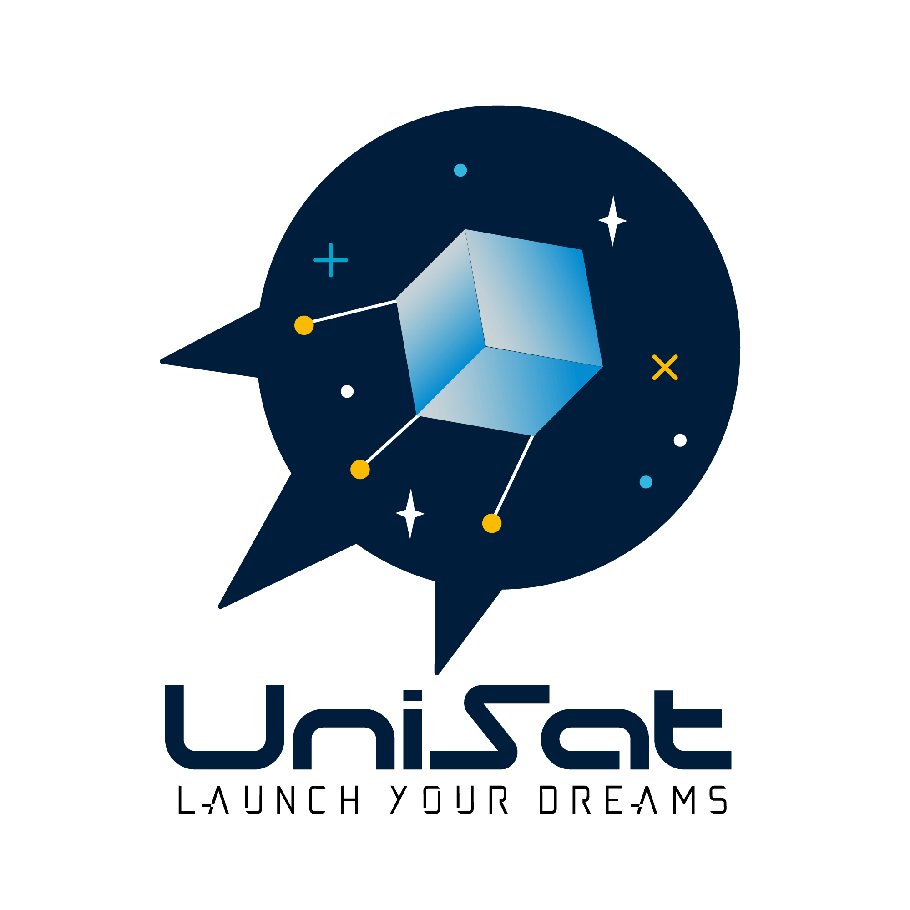

<p align="center">
  <a href="https://unisat.kz">
    
  </a>

  <h3 align="center">USK</h3>

  <p align="center">
    UniSat Nano-satellite Software Kit
    <br />
    <a href="https://unisat.kz"><strong>Explore the project »</strong></a>
    <br />
    <br />
    <a href="https://github.com/unisatkz">Github Home</a>
    ·
    <a href="https://github.com/unisatkz/USK/issues">Report Bug</a>
    ·
    <a href="https://github.com/unisatkz/USK/issues">Request Feature</a>
  </p>

<!-- TABLE OF CONTENTS -->

## Table of Contents

* [About the Project](#about-the-project)
  * [Built With](#built-with)
* [Getting Started](#getting-started)
  * [Prerequisites](#prerequisites)
  * [Installation](#installation)
* [Usage](#usage)
* [Roadmap](#roadmap)
* [Contributing](#contributing)
* [License](#license)
* [Contact](#contact)
* [Acknowledgements](#acknowledgements)


<!-- ABOUT THE PROJECT -->
## About The Project


[Al-Farabi Science and technology park](https://unisat.kz/partner/stp/), together with [UNICEF](https://unisat.kz/partner/unicef/), announces “UniSat Nano-Satellite educational programme for girls (UNEPG)”, in purpose of training girls in designing, developing, assembling, testing nanosatellite system/subsystems.

This is software works as is a support backend of UniSat satellites. Writen with Python, Arduino Sketch, and C89. 

USK, or UniSat Software Kit, includes the software program for two of main UniSat boards, the OBC (On board computer) and the UniSense (UniSat Sensors and Experimental Board, or Sensor Board for short).

As we have girls in the team that are not very familiar with programming languages like C++ or C, or many of them have no background with linux driver development, we build USK as an absctract wrapper for all the functions and attributes that the sensors and OBC may provide.

The sensor board as a whole abstracted as a `UniSense` class, that you will able to read all the sensor data using Python’s `.dot` technique, and you don’t even have to import any extra drivers that are already included out of the box for you.

### Built With

USK literally not use any frameworks, we use awesome little tools:
* Arduino Sketch
* RPi.GPIO
* Thonny

<!-- GETTING STARTED -->

## Getting Started

The philosophy of USK is “easy but powerful”, so it won’t be hard for anyone with just a little programming knowledge to get started.

### Prerequisites

This is an example of how to list things you need to use the software and how to install them.
* `Git`

> We do think that you will run USK on your Linux machine (Or a MacOS) or micro-processors like RPi or micro-bit, USK dose support installing on Windows theoretically but not tested yet

**Linux (RPi)**

```sh
sudo apt update && sudo apt upgrade
sudo apt install git
```

**Mac OS**

If you don’t have `brew`, install it [here](https://brew.sh/), then you can install git from terminal:

``` bash
brew update
brew upgrade 
brew install git
```

* `build eseential` (only for linux, **you don’t have to do this on Mac**)

``` bash
sudo apt install build-essential
```

* `python-dev` (only for linux, **you don’t have to do this on Mac**)

**Linux**

``` bash
sudo apt install python3-dev
```

### Installation

You can install the package using PyPi or Using Git, YOU DO NOT HAVE TO DO BOTH.

#### Using PyPi

``` bash
sudo pip3 install usk
```

> Remember to use `sudo` as we need to use the Raspberry Pi pins that only accessible for admins.

#### Using Git

1. Open your terminal
2. Clone the repo
```sh
git clone https://github.com/unisatkz/USK.git
```
3. Install Python  packages
```sh
sudo python3 setup.py install 
```
4. Import the package in Python 
```python
import usk
```

<!-- USAGE EXAMPLES -->
## Usage

You can use USK in highly abstracted way, using UniSat’s each board as a top class, and getting it’s value by calling it’s attributes and methods (recommended), for those who want much more detailed information, you can use USK sensors separately.

**Example: UniSat Sensorboard as a class** (Abstraction)

``` python
from usk.Sensor import UniSense # this acts as a whole.

sensor = UniSense()
sensor.update_data()
print(sensor.temperature_bme)
print(sensor.temperature_bno)
print(sensor.pressure)
print(sensor.UVindex)
print(sensor.humidity)
print(sensor.linear_acceleration)
print(sensor.IR)
print(sensor.magnetic)
sensor.print_attrs() # you can get all available attributes by this.
```

This is helpful when you want to getting started quickly.

``` python
import time
from usk.Sensor import UniSense

sensor = UniSense()
sensor.print_attrs()
while True:
    sensor.update_data()
    print(sensor.temperature_bme)
    print(sensor.temperature_bno)
    print(sensor.humidity)
    print(sensor.pressure)
    print(sensor.acceleration)
    print(sensor.gyro)
    print(sensor.magnetic)

    time.sleep(10)

```

**using USK sensors separately**

``` python
import time
from usk.back import BME
bme = BME()
if bme.ok():
    print(bme.temperature)
    print(bme.pressure)
    print(bme.humidity)
```

**OBC example**

``` python
from usk.OBC import Pi
pi = Pi()
print(pi.temperature)
print(pi.platform_info)
print(pi.python_version)
print(pi.ram)
print(pi.rom)
```

<!-- ROADMAP -->
## Roadmap

See the [open issues](https://github.com/unisatkz/USK/issues) for a list of proposed features (and known issues).

<!-- CONTRIBUTING -->

## Contributing

Any contributions you make are **greatly appreciated**.

1. Fork the Project
2. Create your Feature Branch (`git checkout -b feature/AmazingFeature`)
3. Commit your Changes (`git commit -m 'Add some AmazingFeature'`)
4. Push to the Branch (`git push origin feature/AmazingFeature`)
5. Open a Pull Request

<!-- LICENSE -->
## License

Distributed under the MIT License. See `LICENSE` for more information.


<!-- CONTACT -->
## Contact

Azat - a@azat.ai

Project Link: [https://github.com/unisatkz/USK](https://github.com/unisatkz/USK)

<!-- ACKNOWLEDGEMENTS -->

## Acknowledgements

* [UNICEF](https://unicef.org)
* [Al-Farabi Science Park](https://sciencepark.kz)
* [Python Foundation](https://python.org)
* [Raspberry Pi foundation and Raspberry Pi community](https://www.raspberrypi.org/)
* [Adafruit Electronics](https://www.adafruit.com/)

